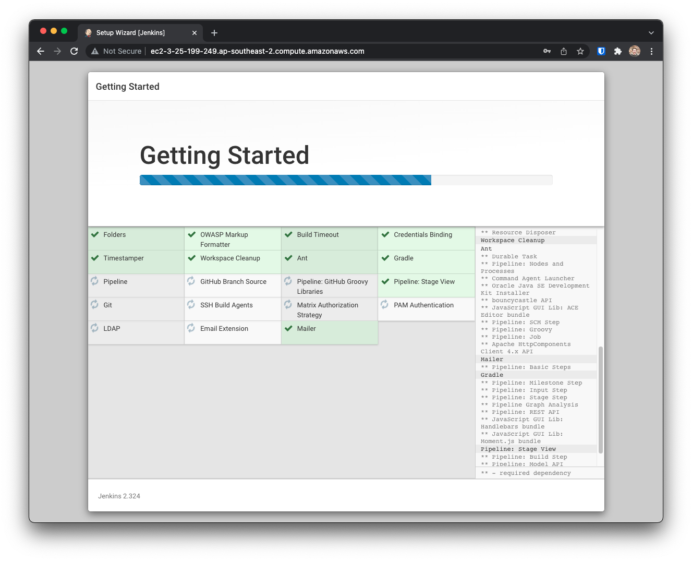
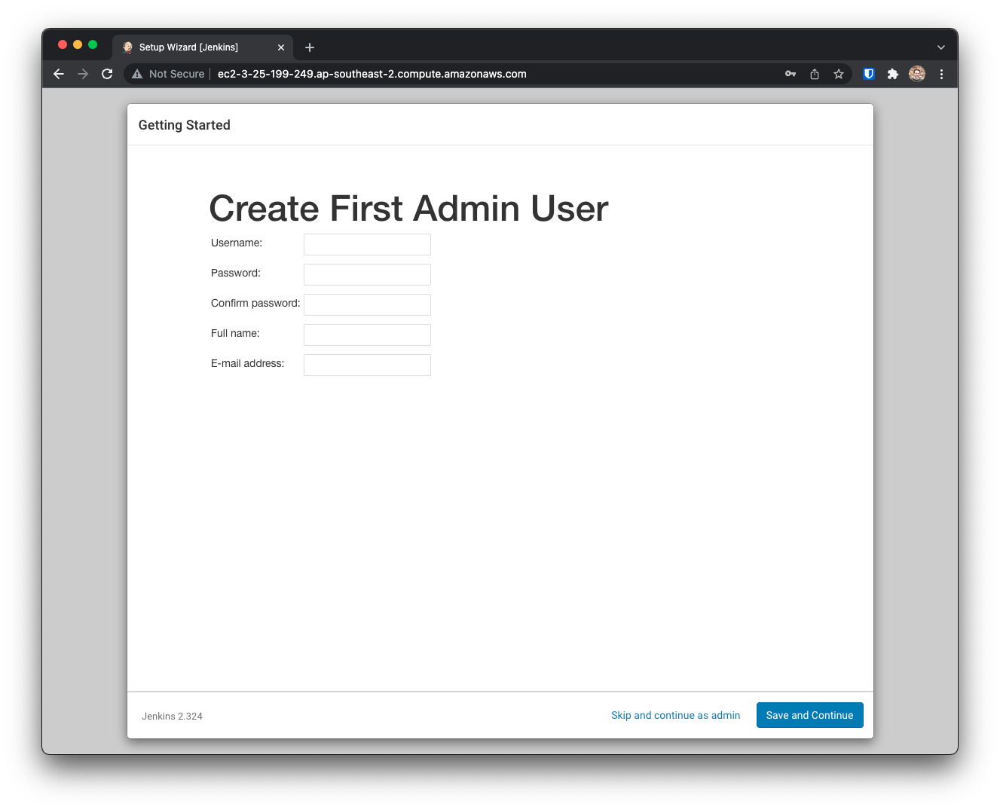
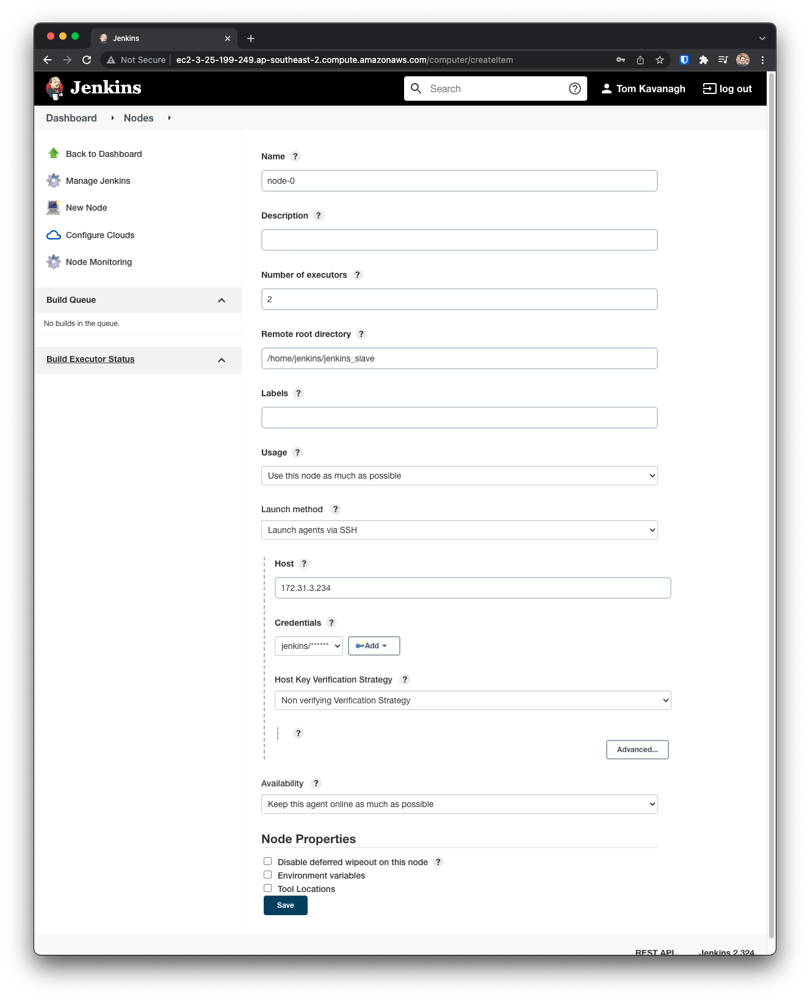

# Jenkins Distributed Build

Creates a Jenkins master and nodes.

## Usage

Setup variables (existing SSH Key in AWS required)
```
export TF_VAR_project_name=jenkins
export TF_VAR_key_name=key-name
```
Change backend details in `meta.tf`.

Run Terraform
```
terraform init
terraform plan
terraform apply
```

## Setting up Jenkins

SSH into master
```
ssh ubuntu@JENKINS_MASTER_ADDRESS
```
`jenkins_master_address` will be outputted by terraform.

Retrieve administrator password:
```bash
sudo cat /root/.jenkins/secrets/initialAdminPassword
```

If using `user_data_for_docker.sh` use:
```bash
cat /opt/jenkins_home/secrets/initialAdminPassword
```

Go to `jenkins_master_address` on port 80 and paste admin password.

Install suggested plugins.



Setup the first admin user, click Next and Save and Finish.



- Click Next and Start using Jenkins.
- Click Manage Jenkins
- Configure System
- Set # of executors to `0` for master and Save

## Setup nodes

- Click Manage Jenkins
- Manage Nodes
- New Node
- Node name: `node 0`, tick Permanent Agent and click Create
- Set # of executors to `2`
- Remote root directory to `/home/jenkins/jenkins_slave`
- Launch method: Launch agents via SSH
- Enter private ip of node-0 as Host
- Add Credentials `SSH Username with private key`
- Enter `jenkins` for the username
- Enter the private key directly pasting in the private SSH key used to provision the instances
- Select Non verifying Vericiation Strategy
- Click Save

Repeat for the other nodes except use `Copy from Existing Node` and enter the name of the first node.
- Click ok
- Change the private ip of the node and click save



## Create a job

- Click create a job from the homepage
- Enter a name
- Select freestyle project and click OK
- Tick Build periodically
- Enter a cron statement for the Schedule `*/1 * * * *`
- Click Add build step, Execute Shell
- Enter `echo "hello world"` for the command
- Click Save

The new job will run every 1 minute on one of the nodes.

## Log Retention

- Open the job from the homepage
- The build history is shown on the left sidebar
- Click a build number and open Console Output.
- You can see the hello world build executed on the node.
- Go back to the Project and click Configure
- Tick Discard old builds and set the Max # of builds to keep to `5`.
- Click Save

Only 5 of the last builds for this project will be kept.

## Build labels

- Open node configurations and configure Node 1
- Enter the `node-1` for Labels
- Set usage to Only build jobs with label expressions matching this node
- Click Save

- Configure the test job from the previous step
- Tick `Restrict where this project can be run`
- Enter `node-1` for the Label Expression
- Click Save

The next build will run on `node-1`.

## Extend execution time

- Reconfigue the test job
- Change the shell command to the following:
```bash
echo "hello world"
sleep 15
echo "goodbye"
```
- Click Save

The next build will pause and run for longer.
You should see the job in the Build Executor Status sidebar on the homepage when it executes.
